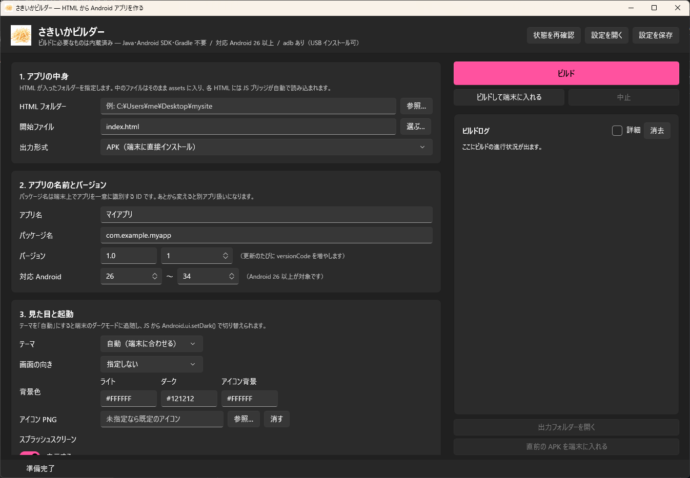
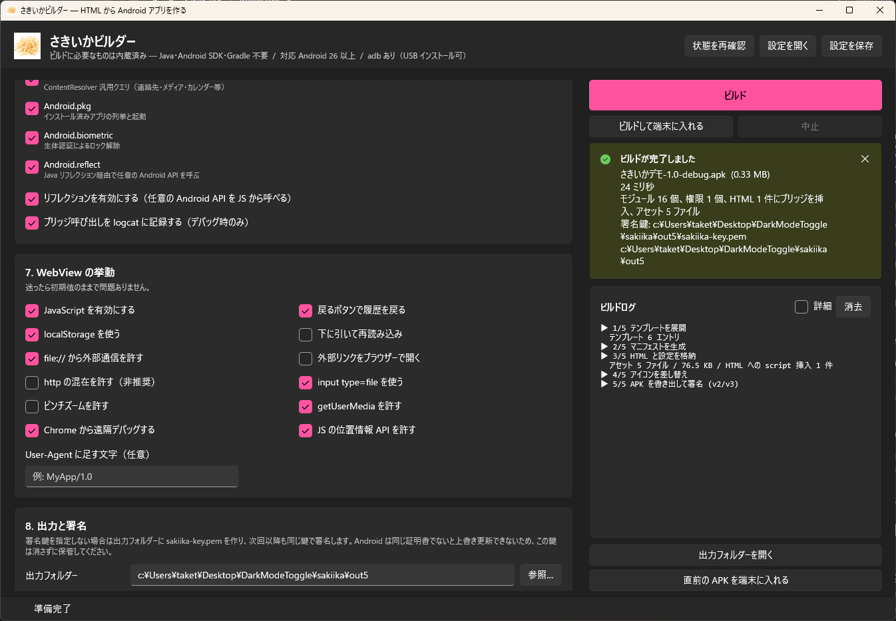
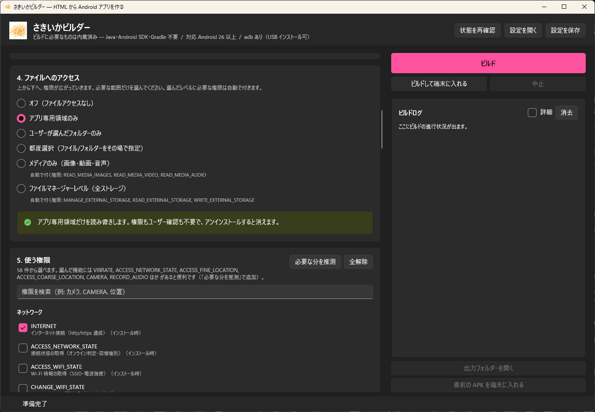
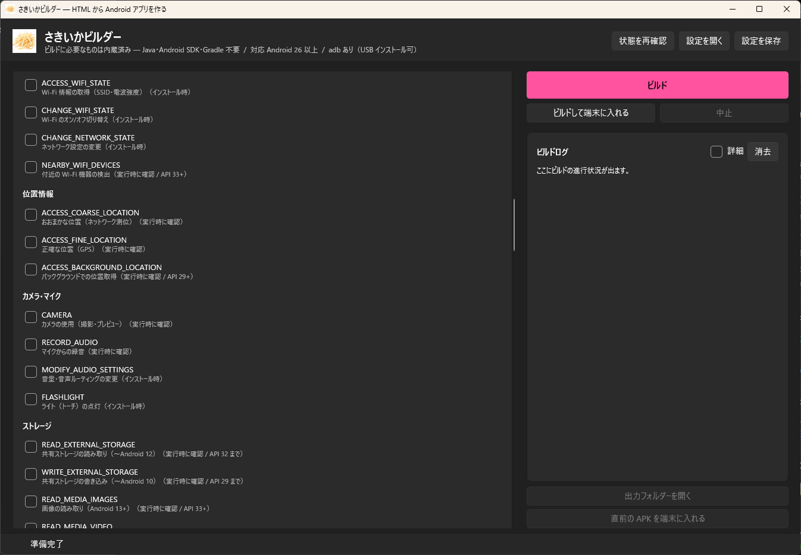

<p align="center">
  
</p>

<h1 align="center">さきいかビルダー</h1>

<p align="center"><b>HTML フォルダーを指定して Android アプリ (APK / AAB) を作る Windows ツール</b></p>

<p align="center">
  Java・Android SDK・Gradle は<b>利用者の PC に一切不要</b>。コンパイル済みの Android ランタイムを
  実行ファイルに埋め込んであり、マニフェスト生成から署名まで内蔵の処理で完結するため、
  <b>ビルドは数十ミリ秒</b>で終わります。
</p>

<p align="center">
  <a href="https://github.com/SakiikaVR/Sakiika-Builder/releases/latest">
    
  </a>
  <a href="https://github.com/SakiikaVR/Sakiika-Builder/releases/latest">
    
  </a>
  <a href="LICENSE">
    
  </a>
</p>

---

## 🚀 クイックスタート (3 ステップ)

1. **[📦 最新リリース](https://github.com/SakiikaVR/Sakiika-Builder/releases/latest)** から `SakiikaBuilder-Windows-x64.zip` をダウンロードして解凍し、`SakiikaBuilder.exe` を実行
2. **HTML フォルダー**を選び、**アプリ名**と**パッケージ名**を入れる
3. 「**ビルド**」を押して完了 🎉

> インストールもセットアップもありません。解凍したフォルダーからそのまま動きます。
> 出力先は既定で HTML フォルダーの隣の `sakiika-out`。
> 署名鍵は同じフォルダーに `sakiika-key.pem` として作られ、次回以降も再利用されます。

## 🖼️ 画面

<p align="center">
  
</p>

<p align="center">
  <b>ビルドは 24 ミリ秒。</b>外部ツールを一切呼ばないので、押した瞬間に終わります。
</p>

<p align="center">
  
</p>

<p align="center">
  ファイルへのアクセスは 6 段階。必要な範囲だけを選べます。
</p>

<p align="center">
  
</p>

<p align="center">
  権限は 58 件から選択式。何のための権限かと、実行時確認が必要かどうかが並びます。
</p>

<p align="center">
  
</p>

## ✨ 機能

- 🚫 **Java / Android SDK / Gradle 不要** — 必要なものは実行ファイルに内蔵。`adb` すら任意です
- ⚡ **数十ミリ秒でビルド** — 重い処理はリリース時に済ませてあり、ビルドは組み立てと署名だけ
- 📦 **APK と AAB の両方** — AAB は Google Play へのアップロード用。両方同時に出力できます
- 🔑 **署名まで内蔵** — APK Signature Scheme v2/v3、AAB は JAR 署名。鍵も自動生成して再利用します
- 🧩 **JavaScript から Android API** — 端末情報・ファイル・センサー・位置・カメラ・通知・連絡先など 16 モジュール
- 🪞 **リフレクションで「全部」** — カタログに無い Android API も JS から直接呼べます
- 🛡️ **権限は選択式** — 58 件から選択。実行時確認が必要なものは自動で判別します
- 📂 **ファイルアクセス 6 段階** — オフ / アプリ専用 / フォルダー指定 / 都度選択 / メディアのみ / ファイルマネージャー相当
- 🎬 **スプラッシュの無効化** — 起動を最短にできます
- 🎨 **アイコンとテーマ** — PNG 指定、背景色、ライト/ダーク、画面の向き

## 📜 JavaScript から Android を触る

ビルド時に各 HTML の `<head>` へブリッジが自動挿入されるので、読み込みは不要です。

```html
<script>
  if (window.Android && Android.available) {
    await Android.ui.toast({ text: "こんにちは" });

    const info = await Android.sys.info();
    console.log(info.model, info.sdkInt);

    // カタログに無い API はリフレクション経由で
    const vib = await Android.reflect.service({ name: "vibrator" });
    await Android.reflect.call({
      ref: vib.__ref, method: "vibrate",
      args: [{ type: "long", value: 50 }]
    });
  }
</script>
```

| モジュール | 内容 |
|---|---|
| `sys` `ui` | 端末情報・画面・バッテリー / トースト・バイブ・ダークモード・共有・ネイティブダイアログ |
| `fs` `prefs` `clipboard` | ファイル読み書きとピッカー / 永続ストア / クリップボード |
| `net` `intent` `pkg` | CORS 制約のない HTTP / 任意 Intent / インストール済みアプリ |
| `sensor` `location` `media` | センサー購読 / 位置追跡 / 撮影・録音・読み上げ・ライト |
| `notify` `content` `perm` `biometric` | 通知 / ContentResolver 汎用クエリ / 権限要求 / 生体認証 |
| `reflect` | **任意の Java / Android API** |

**メソッド一覧・イベント・リフレクションの詳しい使い方は [docs/JS-API.md](docs/JS-API.md)** にあります。

## 📂 ファイルへのアクセスは 6 段階

| レベル | できること | 権限 | ユーザーの操作 |
|---|---|---|---|
| `off` | 何もしない (`fs` が無効) | なし | なし |
| `app_private` | アプリ専用領域だけ | なし | なし |
| `folder_pick` | 選んだ 1 フォルダーの配下だけ | なし | 初回に選択(以降も保持) |
| `documents` | 上記＋その場で追加選択 | なし | 都度選択 |
| `media_only` | 画像・動画・音声の読み取り | `READ_MEDIA_*` | 実行時ダイアログ |
| `full_manager` | 全ストレージ | `MANAGE_EXTERNAL_STORAGE` | 設定画面で手動許可 |

> `folder_pick` と `documents` は SAF を使うので**権限が一切要りません**。
> 広い権限が必要なのは下 2 つだけです。`full_manager` は Google Play で用途の審査対象になります。

## 📦 APK と AAB

| | APK | AAB |
|---|---|---|
| 端末に直接インストール | できる | **できない** |
| Google Play へのアップロード | 新規アプリは不可 | **こちら** |
| 署名方式 | APK Signature Scheme v2 + v3 | JAR 署名 (PKCS#7) |
| マニフェスト / リソース | バイナリ AXML / `resources.arsc` | protobuf / `resources.pb` |

AAB は「端末ごとに最適化した APK を Google Play 側で作るための入れ物」なので、そのままでは
インストールできません。手元で試すなら出力形式に「**APK と AAB の両方**」を選んでください。

## ⚙️ 仕組み

重い処理は**リリースごとに 1 回だけ**行い、利用者のビルドからは外部ツールを完全に取り除いています。

| 置き換えた Android SDK ツール | 内蔵実装 |
|---|---|
| `javac` + `d8` | プリビルド済み `classes.dex` を埋め込み |
| `aapt2` (マニフェスト) | バイナリ AXML ライター / protobuf ライター |
| `aapt2` (リソース) | プリビルド済み `resources.arsc` / `resources.pb` を再利用 |
| `aapt add` + `zipalign` | 4 バイト整列付き ZIP ライター |
| `apksigner` + `keytool` | APK Signature Scheme v2/v3 (EC P-256、純 Rust) |
| `jarsigner` | JAR 署名 (MANIFEST.MF / .SF / PKCS#7) |

自前実装が本物として通用するかは、実際の Android SDK ツールで確認しています。

| 確認内容 | 使ったツール | 結果 |
|---|---|---|
| APK 署名 | `apksigner verify` | v2・v3 とも検証通過 |
| APK の整列 | `zipalign -c -p 4` | 整列 OK |
| APK のマニフェスト | `aapt2 dump badging` | 正しく解釈 |
| AAB の構造 | `bundletool validate` | 通過 |
| AAB から APK を生成 | `bundletool build-apks` | 成功。生成された APK も正常 |
| AAB の署名 | `jarsigner -verify` | 検証通過 |

**内部構造の詳細は [docs/INTERNALS.md](docs/INTERNALS.md)** にあります。

## ❓ トラブルシューティング

| 症状 | 対処 |
|---|---|
| 「ランタイムが埋め込まれていません」と出る | 配布物が壊れています。リリースの ZIP を再取得してください |
| minSdk を 26 未満にできない | アダプティブアイコンと v2 署名の要件です。Android 8.0 未満には対応できません |
| ビルドは通るがアプリが真っ白 | 開始ファイル名を確認。`chrome://inspect` で WebView をデバッグできます(「Chrome から遠隔デバッグする」が有効なとき) |
| `fs` が `no_root` を返す | `folder_pick` / `documents` では先に `Android.fs.chooseRoot()` でフォルダーを選んでもらう必要があります |
| `content.query` が `permission_denied` | 対応する権限(`READ_CONTACTS` など)をビルド時に有効にし、`Android.perm.request` で実行時許可を取ってください |
| 「アプリがインストールされていません」 | 同じパッケージ名で別の鍵で署名したアプリが入っています。一度アンインストールしてください |
| 「ビルドして端末に入れる」が押せない | `adb` が見つからないときは無効になります。APK を端末にコピーして開けばインストールできます |

## 💻 動作環境

- Windows 11 x64 (Windows 10 でも動作想定)
- .NET ランタイム同梱のためインストール不要
- 作られるアプリの対象は **Android 8.0 (API 26) 以上**
- `adb` は USB インストールに使うだけで、無くても APK を端末にコピーすれば動きます

## 🧪 デモアプリ

リリースの `sakiika-demo-1.0.apk` は、ブリッジのほぼ全機能をその場で試せるアプリです
(ソースは [demo/](demo/))。

- モジュールごとのタブ。各機能が入力欄つきのカードになっていて、押すとその場で実行
- 結果は整形 JSON で表示。画像が返るものはプレビュー
- 実際に歩けるファイルブラウザー(選んだアクセスレベルの範囲を体感できます)
- リフレクション実験台とイベントログ

## 📄 ライセンスと表記

- 本リポジトリは **MIT** で公開しています ([LICENSE](LICENSE))
- 生成されるアプリの Java ランタイムは AndroidX などのライブラリを使わず、`android.jar` のみに依存します
- 署名鍵 (`sakiika-key.pem`) は自己署名の EC P-256 鍵です。**Android は同じ証明書でないと上書き更新を受け付けないため、この鍵は必ず保管してください**
- GUI は Windows App SDK / WinUI 3 (MIT) を使用しています
- ランタイムテンプレートの生成にのみ Android SDK Build-Tools を使用します(生成物には同梱していません)

## 🛠️ 開発者向け

```powershell
git clone https://github.com/SakiikaVR/Sakiika-Builder.git
cd Sakiika-Builder
.\build.ps1              # エンジン + GUI
.\build.ps1 -Template    # ランタイムテンプレートも作り直す
.\build.ps1 -Demo        # デモアプリの APK も作る
```

テンプレートを作り直すときだけ Android SDK (build-tools + platforms) と JDK 17 が必要です。
自動検出に失敗する場合は環境変数で指定します。

```powershell
$env:SAKIIKA_SDK = "C:\AndroidSDK"
$env:SAKIIKA_JDK = "C:\Program Files\Eclipse Adoptium\jdk-17..."
```

CLI 単体でも同じことができます。

```powershell
sakiika quick --web .\www --name "テストアプリ" --package com.example.test --format both
sakiika doctor        # 動作状態
sakiika permissions   # 選べる権限
sakiika modules       # JS ブリッジのモジュール
sakiika --help
```

内部構造・テンプレートの作り方・アイコンの差し替えは [docs/INTERNALS.md](docs/INTERNALS.md)、
JavaScript API の全一覧は [docs/JS-API.md](docs/JS-API.md) を参照してください。
